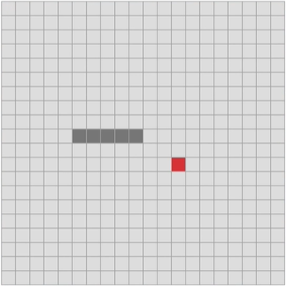

# Snake Game - JS

Project Base:
20 horizontal squares x 20 vertical squares using html5 and javascript canvas.

# Print of final project

 in progress

# How to run this project on your machine?

    git clone https://github.com/leosena777/game-snake-javascript.git
    cd game-snake-javascript
    npm run start

